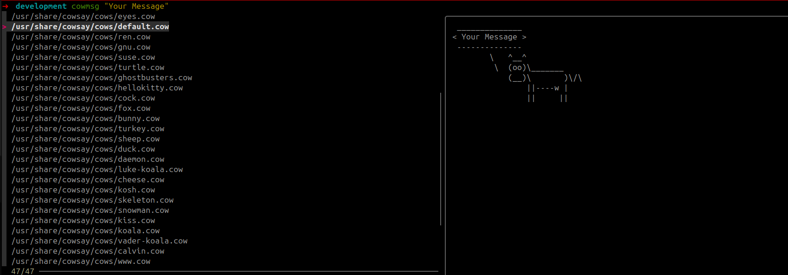

# Cowsay

> Credits to my friend Angelo Ross


## Linux setup

### Install dependencies
```shell
sudo apt install cowsay fzf
```

> About cowsay https://en.wikipedia.org/wiki/Cowsay

Create alias for `cowsay.sh` file and save in your PATH


### Create alias
```bash
# .zshrc or .bashrc 

alias cowmsg='/home/path/to/repo/cowsay/cowsay.sh'
```

### Usage

```bash
cowmsg "Your message"
```




Choose the format and be happy :)